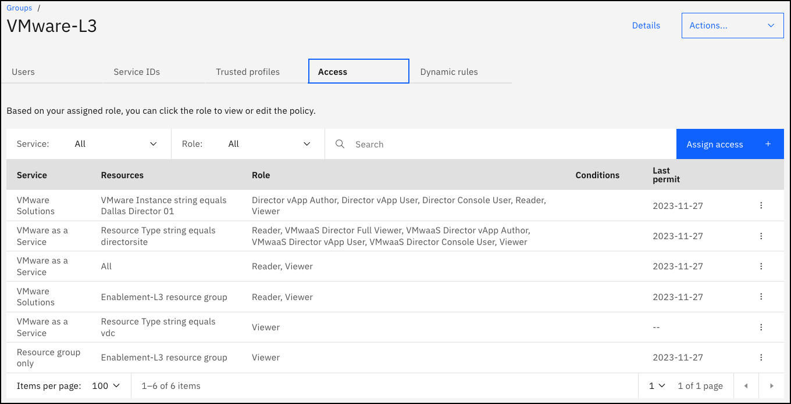

# SalesEnablement-VMware-L3
Sales Enablement Level 3 training for IBM Cloud for VMware Solutions

**Last publish date:** November 29, 2023

**ITZ Collection:** https://techzone.ibm.com/collection/ibm-cloud-for-vmware-level-3

**ITZ Environment:** https://techzone.ibm.com/my/reservations/create/638a1f6a308f5500188808a7

ITZ gitops pattern: https://github.ibm.com/dte2-0/ccp-gitops-patterns/tree/main/ibm-vmware-se-l3

ITZ account: 2326338 - ITZ-VMWARE

## Summary of environment and automation

For this lab, no new resource are provisioned. The lab consists of many click-thru demonstrations and pre-provisioned instances of VMaaS (single- and multitenant) and VMware Shared (1 site with 2 instances). These are all managed services so there should be very little maintenance from our perspective.

In the ITZ automation, users are added to the above ITZ account and the VMware-L3 IAM access group. The access group has the following access roles/policies defined:

## Maintenance

Verify the following resources are available (https://cloud.ibm.com/vmware/resources/vdc):

VMwaaS:

- Multitenat: mt-vdc (WDC)

- Single-tenant: se-l3-development (Dallas)

- Single-tenant: se-l3-test (Dallas)

VMware Shared:

- Site: Dallas Director 01 (Dallas)
  
- VDCS: se-l3-shared and bienko-vdc

For each of the virtual data centers above, check on resource utilization and power-off and remove any VMs that are > 2 weeks old. This more than the maximum days for an ITZ reservation.

The only VMs that should always be provisioned are:
multitenant: dev-1 (powered off)

Here is a video of me powering off and removing leftover VMs:

https://github.com/IBM/SalesEnablement-VMware-L3/assets/29982016/237cbd21-9a09-4926-a730-8b115a419aa0

