While some of the modules in the **{{guide.name}}** use click-through demonstrations, other modules use pre-provisioned VMware Cloud Foundation (VCF) as a Service instances running in IBM Cloud in an IBM Technology Zone (ITZ) owned IBM Cloud account. The resources in this IBM CLoud account are shared by all users with an active ITZ reservation for the environment. To access these resources, you must first create a reservation in ITZ for the environment. Detailed steps for creating the reservation and accessing the environment are provided below.

!!! Important "About the IBM Technology Zone (ITZ) environment"

    Before proceeding, read and understand the details about the ITZ environment and your access in the ITZ IBM Cloud account.

    - You must first accept the invitation to join the ITZ IBM Cloud account before you will be able to access it. Details below in the step-by-step guidance.
    
    - Your user ID in the ITZ IBM Cloud account is limited. You will **not** be able create new IBM Cloud resources (for example you will not be able to provision an VCF as a Service instance). You will **not** be able to delete, or modify the pre-provisioned resources.
    
    - Your user ID **will** have permission to create, delete, and modify resources in the provisioned VCF as a Service instances using VMware vCloud Director (VCD). 
    
    - In the VCF as a Service instances, do not delete or modify any of the pre-provisioned resources as described in the demonstration guide.
    
    - In the VCF as a Service instances, you are responsible for deleting any resources you create. Do this before your ITZ reservation expires.
    
    - Remember, that the environment is shared by all users of the environment. Do **not** delete or modify resources created by other users.
  
## Creating a reservation
Follow these steps to create a reservation in ITZ.

1. Click the link below to open a browser to the reservation page of the **{{itz.collectionName}}**.

    !!! Warning "You may be asked to authenticate to IBM Technology Zone"

        These steps are not detailed here.

    <a href="{{itz.environment}}" target="_blank">{{itz.collectionName}} - reservation page</a>

2. Click **Reserve now**.

    The **Reserve now** option requests the reservation be created now. You can optionally schedule the reservation for later if you like.

    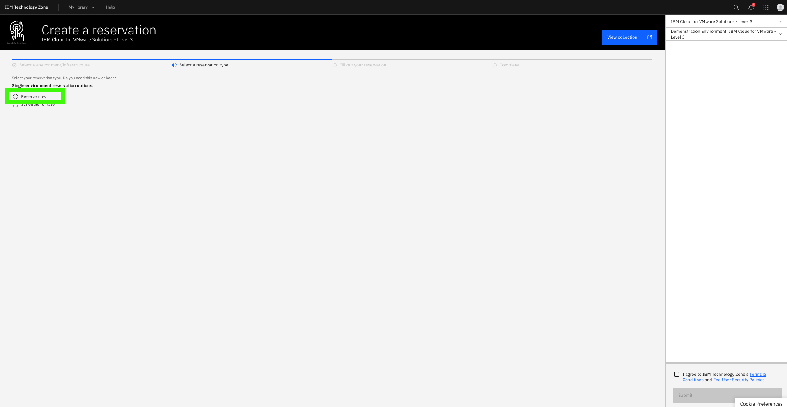

3. Complete the form and click **Submit**.

    **a**. You can optionally change the **Name** field for the reservation.

    **b**. Select the **Education** purpose tile.

    **c**. Enter a **Purpose description**.

    **d**. Select any geography in the **Preferred Geography** drop-down.

    **e**. The **End date and time** will be set to 2 days after the current date and time.

    !!! tip "Extending a reservation"

        The initial reservation duration is set by ITZ at 2 days and cannot be extended at the time the reservation is created. You can, and are encouraged to, extend the reservation once it is in the **Ready** state. Two extensions of 2 day increments is allowed. Steps to extend the reservation are shown below.

    **f**. Accept the IBM Technology Zone's terms and conditions and security policies.

    **g**. When satisfied with the parameters, click **Submit**.

    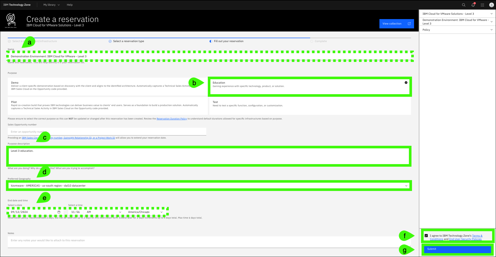

## Extend the reservation
The ITZ provisioning process takes approximately 10 minutes. During this process, your user ID is created in the ITZ IBM Cloud account and added to the appropriate security access group. 

You will receive multiple emails from ITZ as the provisioning process runs. One will state the reservation is provisioning and the other will say the environment is **Ready**. 

In rare cases, the provisioning process may fail. If you receive and email stating the reservation failed, try again by repeating steps 1-3.

Once your reservation is in the **Ready** state, you can extend the reservation to a total of 6 days. Depending on your schedule, you may want to do this. Remember, IBM sellers will need the environment to record their Stand and Deliver, and Business Partners will need it while taking the quiz.

4. Click **My reservations** or if the button doesn't work, expand **My Library** and select **My Reservations**.

    With some browsers the **My reservations** button does not always work.

    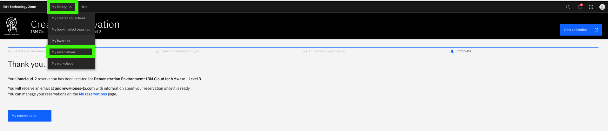

5. Click the **overflow icon** () on the reservation tile and select **Extend**.

    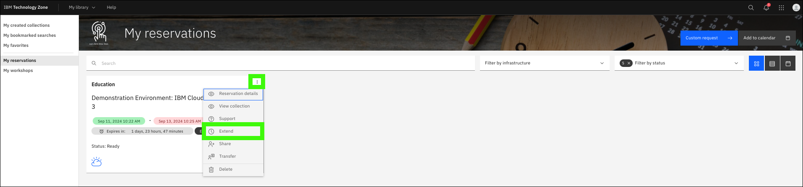

6. Click the **Select a date** option, specify the date to extend to, and then click **Extend**.

    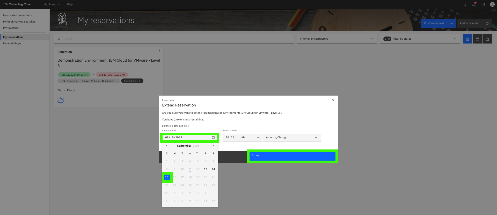

If you anticipate needing additional time, repeat steps 5 and 6 once more to extend the reservation to the maximum of 6 days.

## Accept the invitation to join the ITZ IBM Cloud account
In addition to the ITZ emails, you will receive an email from **IBM Cloud** inviting you to join the ITZ IBM Cloud account. This email will arrive just before or after you receive the ITZ email stating the reservation is ready. If you do not receive the email from IBM Cloud, log into the <a href="https://cloud.ibm.com" target="_blank">IBM Cloud portal</a> and skip to step 8.

7. Open the email from IBM Cloud, and click **Join now**.

    After clicking **Join now** a browser window should open.

    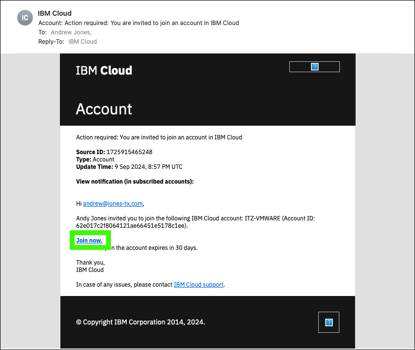

Clicking the *Join now* link should open a browser window to an IBM Cloud portal log in page. Follow the directions to log in and jump to step 11.

If you are not directed to a page to accept to join the account and land on the main page of the IBM Cloud portal for another IBM Cloud account you are already a member of, follow the next steps.

8. Click the **Notifications** icon ().

    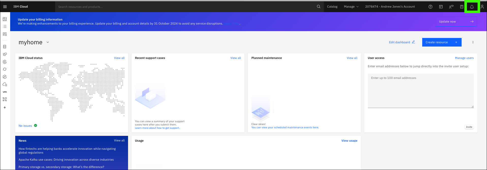

9.  Click the most recent notification with the subject **Action required: You are invited to join an account in IBM Cloud**.

    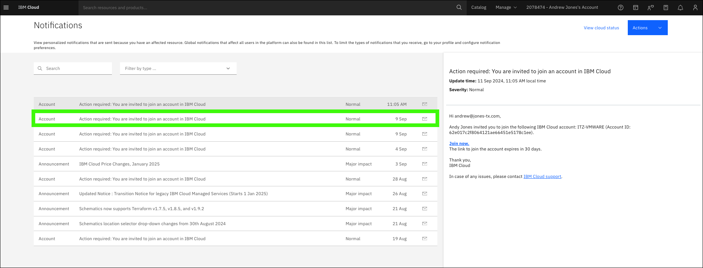

10. Click **Join now** in the notification.

    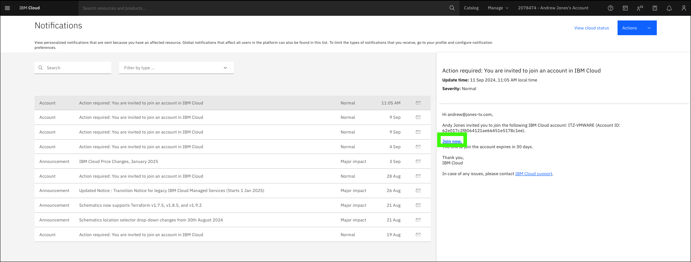

11. Select **I accept the product Terms and Conditions of this registration form** in the **Account notice** tile.

    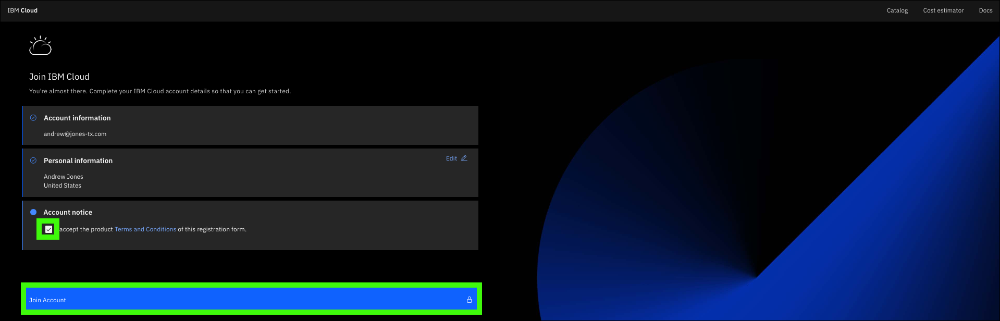

12. Click **Proceed** to switch to the ITZ IBM Cloud account.

    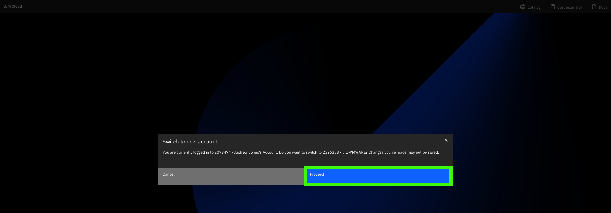

13. Verify you are logged into the ITZ IBM Cloud account ({{itz.account}}).

    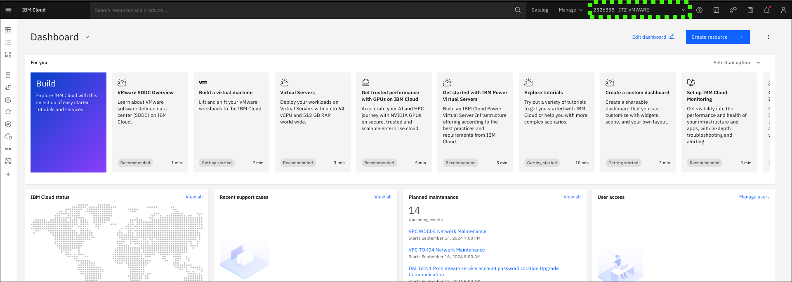

    Note, if your browser window is small, the **Account** drop down list in top menu may be replaced if the **Switch account** icon (). Click the **Switch account** icon to verify the **{{itz.account}}** is selected as the active account.

    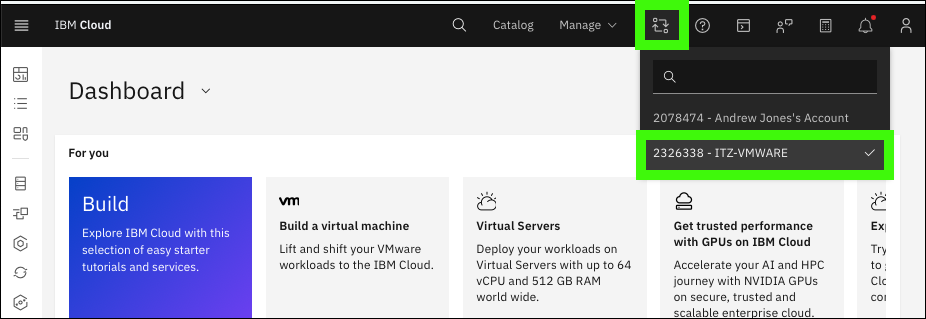

Your ITZ reservation is now active, and you have access to the IBM Cloud account and shared, pre-provisioned resources required to complete the {{learningplan.name}} learning plan.