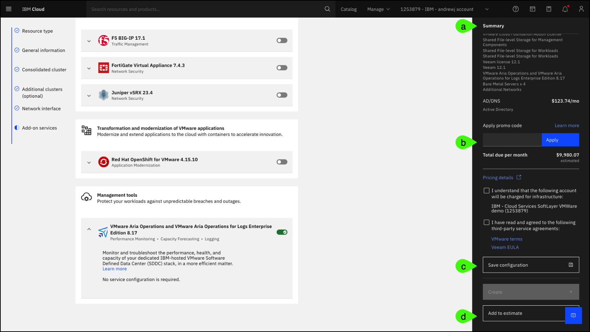

Use the click-through demonstration below to practice provisioning a VMware Cloud Foundation (VCF) for Classic instance.

!!! Important "About the IBM Technology Zone (ITZ) environment"

    The steps that follow are specific to the provisioning process of VCF for Classic as of August 2024. 
    
    These steps can also be used in the IBM Cloud portal. Users can perform these steps to configure the instance in the reserved ITZ environment until the last step (click create). 
    
    If using the ITZ cloud account and the **Create** button is clicked, an error will occur. This is expected as users added to the IBM Cloud for the ITZ environment do **NOT** have permission to provision or modify existing resources. 

    **If the steps are performed in a different IBM Cloud account where the user has permission to create new resources, the account will be charged for any and all resources provisioned!**

!!! tip
    
    When using the click-through demonstration, if you are not sure where to click or what to do next, simply click anywhere on the screen and the place to click next will be highlighted. Text entry fields are pre-populated in the click-through demonstration.

1. Open the link below and then click the play button  to begin the demonstration.

    **Click-through demonstration:** <a href={{clickthru.vcsProvisioning}} target ="_blank">Provision an instance of VCF for Classic</a>

<!-- **Click-thru demo:** <a href="https://ibm.github.io/SalesEnablement-VMware-L3/includes/VMware-Dedicated-Provisioning/index.html" target ="_blank">Provision an instance of IBM Cloud VMware Solutions **Dedicated**</a> -->

2. Click the **VMware**  icon in the left menu.
3. Click the **VMware Cloud Foundation (VCF) for Classic** tile.
4. Read and then click the **Information** dialog.

    The message states:
    
    *The VMware licensing model has changed. All newly provisioned resources are entitled to the VMware Cloud Foundation bundle with "Enterprise Plus" licenses for VMware components.*
    
    After acquiring VMware, Broadcom made many changes to the licensing of the VMware portfolio. Learn more about the VCF for Classic licensing model <a href="https://cloud.ibm.com/docs/vmwaresolutions?topic=vmwaresolutions-vmwaresol_packaging-pricing#vmwaresol_packaging-pricing-impact" target="_blank">here</a>.

    VCF on Classic supports four (4) **Resource type** options. For this demonstration, only the **VMware Cloud Foundation for Classic - Automated** resource type is used. Expand the **Resource types** section and learn the differences between each **Resource type**. The descriptions are from the **About** page in the IBM Cloud portal.

    ??? Note "Resource types"

        === "Automated"       
            
            VMware Cloud Foundation for Classic - Automated is a hosted private cloud that delivers the VMware vSphere stack as a service. The VMware environment is built on top of a minimum of three IBM Cloud bare metal servers, shared file-level storage or dedicated VMware vSAN storage, and it includes the automatic deployment and configuration of an easy to manage logical edge firewall that is powered by VMware NSX.

            The entire environment can be provisioned in a matter of hours, and the elastic bare metal infrastructure can scale out the compute capacity rapidly when needed. IBM Cloud provides you with full, native root access to the VMware ESXi hosts, NSX Manager, and the centralized platform for management, vCenter Server.

            You can move your workloads to and from the cloud without changing your apps, tools, scripts, or investing in new skills. Platform instances and expansion nodes are priced per month and they include access to IBM Support and all VMware components that comprise the service.

            Learn more about the **Automated** option <a href="https://cloud.ibm.com/docs/vmwaresolutions?topic=vmwaresolutions-vc_vcenterserveroverview" target="_blank">**here**</a>.

        === "Flexible"
        
            Formerly VMware vSphere
    
            VMware Cloud Foundation for Classic - Flexible gives you maximum flexibility to build your own IBM-hosted environment using VMware-compatible hardware and the right set of VMware components that fit your business needs and expertise.

            You can design your hosted VMware environment any way you want: from a single ESXi server to a robust software-defined data center (SDDC) architecture. The VMware Cloud Foundation for Classic - Flexible helps you extend your on-premises VMware environment into IBM Cloud.

            VMware Cloud Foundation for Classic - Flexible lets you start as small as a single ESXi server and scale the instance by rapidly provisioning ESXi on single-tenant bare metal servers. Expand your on-premises data center capacity without sacrificing the enhanced security of dedicated infrastructure. VMware Cloud Foundation for Classic - Flexible also offers the latest native VMware encryption options at the VM-level or at the vSAN datastore-level.

            Access the IBM-hosted VMware environment with the same level of control and visibility that you have on-premises. With full administration permissions to the VMware stack, you have total control and can continue leveraging your investment in tools, scripts, and training to manage the off-premises environment.

            Platform instances and expansion nodes are priced per month and include access to IBM Support and all VMware product licenses that comprise the service.

            Learn more about the **Flexible** option <a href="https://cloud.ibm.com/docs/vmwaresolutions?topic=vmwaresolutions-vs_vsphereoverview" target="_blank">**here**</a>.

        === "Cyber Recovery"

            The value of data is increasing exponentially. Protecting your organization starts with protecting critical data against threats, including ransomware and other sophisticated cyberthreats. Regardless of the industry, geography, or size, every organization is data-driven today, which makes data the currency of the internet economy and therefore a valuable resource and asset.

            The modern threat of cyberattacks and the importance of maintaining the confidentiality, availability, and integrity of data beyond backup and disaster recovery requires a modern IBM Cloud solution that is coupled with advanced offerings in the VMware environment to protect your vital data and systems.

            The Cyber Recovery offering on IBM Cloud can serve as part of your overall cyber resilience strategy, as the IBM advanced automation enables you to increase business agility, accelerate time to market, improve cloud economics, and reduce business risk.

            Included services

              - Veeam with Linux hardened repository
              - Juniper vSRX
              - FortiGate Virtual Appliance

            Recommended services

              - Caveonix RiskForesight

            Learn more about the **Cyber Recovery** option <a href="https://cloud.ibm.com/docs/vmwaresolutions?topic=vmwaresolutions-cr_overview" target="_blank">**here**</a>.

        === "Regulated Workloads"

            With the ever increasing threat of cybersecurity breaches and the challenges that come up when you navigate a changing complex regulatory landscape, financial services companies need a solution to help them meet their security requirements and compliance readiness more quickly.

            IBM Cloud for VMware Regulated Workload solution is built on IBM's industry-leading experience in financial services industry and also on partnerships with three major global banks. The foundation of the solution starts with IBM's unique policy controls framework that feeds into the solution's secure-by-default reference architecture and a zero-trust security model.

            IBM's advanced automation deploys the standardized architecture with the full VMware Software Defined Data Center (SDDC) stack on single-tenant bare metal servers. It also includes VMware vSphere 7 and NSX-T 3, dedicated vSAN storage, and a perimeter edge cluster for extra protection. All hosts are deployed with private-only ports that are enabled on the physical NICs and the network segmentation enables privileged user separation of duties enforcement. All together, this solution provides a new level of compute, networking, and workload isolation.

            The deployment of additional market-leading services helps financial services companies demonstrate regulatory compliance faster and makes it easier and more efficient to maintain compliance readiness.

            Service prerequisites

              - Hyper Protect Crypto Services
              - KMIP for VMware
                - Direct Link Dedicated

            Included services

              - Veeam 12
              - Caveonix RiskForesight
              - VMware Aria Log Insight
              - Juniper vSRX
              - FortiGate Virtual Appliance

             Optional services

              - VMware HCX
              - F5 BIG-IP

            Learn more about the **Regulated Workloads** option <a href="https://cloud.ibm.com/docs/vmwaresolutions?topic=vmwaresolutions-cr_overview" target="_blank">**here**</a>.

5. Click **General information** in left menu.
6. Click the **VMware vSphere version** drop-down list.

    As of August 2024, VCF for Classic supports both VMware vSphere version 7.0u3 and 8.0u2. Use the <a href="https://www.vmware.com/docs/vmw-version-comparison" target="_blank">**VMware version comparison guide**</a> to learn about both.

7. Select **vSphere 7.0u3**.

    The **vSphere 7.0u3** version is selected because at this time VCF for Classic does not support VMware Virtual Storage Area Network (vSAN) on vSphere 8.0u2. If **vSphere 8.0u2** was chosen, the vSAN option would not be visible when specifying the storage type for the **Consolidated cluster**.

8. Click the **VMware vCenter Server version** drop-down list.

    As of August 2024, VCF for Classic supports both VMware vCenter Server version 7.0 and 8.0. Refer to the <a href="https://cloud.ibm.com/docs/vmwaresolutions?topic=vmwaresolutions-vmwaresolutions-relnotes#vmwaresolutions-feb0724" target="_blank">**Release notes for VMware Solutions**</a> to learn more.

9.  Select **vCenter Server 8.0**.
10.  Click the **Instance name** entry field.

    The **Instance name** is used to reference this instance post deployment. The instance name is automatically entered in the click-through demonstration.

11.  Click the **Resource group** drop-down list.

    Resource groups are used to organize cloud resources. The resource group that you select can't be changed after the service instance is created.

12.  Select **Default**.

    Two additional options are available in the **General information** section.

     - **Instance configuration name**
  
        It is possible to save a configuration in the IBM Cloud portal prior to creating an instance. This will be highlighted later. Users can choose from previously saved instance configurations to fill the configuration settings automatically.  

    - **Instance type**

        VCF for Classic supports both **primary** and **secondary** instance types. A **primary** instance is either a single instance in the environment or the first instance in a multi-site topology. A **secondary** instance connects to an existing (primary) instance in the environment for high availability.

13.  Click **Consolidated cluster** in left menu.

    By default, **VCF for Classic - Automated** creates a single, **consolidated cluster** deployment. The **consolidated cluster** is used for both management components and user workloads. Optionally, separate **workload** and **gateway** clusters can be created. These will be explored later.

14. Click the **Geography** drop-down list.

    VCF for Classic is available in IBM Cloud data centers located around the world. For a list of the latest supported locations refer to the <a href="https://cloud.ibm.com/docs/overview?topic=overview-locations" target="_blank">**Region and data center locations for resource deployment**</a> page in the documentation. This documentation provides detailed information about IBM Cloud data centers and multizone region architectures.

15. Select **NA East**.
16. Select **WDC04** in the **Data center** drop-down list.
17. Select **pod 05** in the **Pod** drop-down list.

    Data centers are based on a Point of Deployment (POD) architecture where each data center can have more than one POD, depending on the on-demand build out. Each POD consists of racks, servers, networks, and storage, along with backup power generators. Placing application servers across PODs improves availability.

18. Select the **SAP-certified Cascade Lake** central processor unit (CPU) model.

    The SAP-certified option filters the hosts that completed SAP infrastructure-as-a-service (IaaS) certification for compatibility, supportability, and performance with SAP software applications.

19. Click the **next page icon** ().
20. Select the **Cascade Lake** CPU model.
21. Select the **Dual Intel Xeon Silver 4210** CPU model name.

    Selecting the best CPU model for a deployment is an important step that needs to be considered based upon the workloads that will run in the environment. In addition, the model selected will affect the options available for memory and storage.

22. Click the **RAM** drop-down list.

    Rightsizing the memory of the consolidated cluster is an important step, but know it is possible to add and remove memory later after the instance is provisioned, up to the maximum supported by the CPU model selected. The amount of memory may impact what additional services can be deployed during the instance provisioning process. 

23. Select **384 GB**.

    The **Number of bare metal servers** field specifies how many servers are created in the cluster. A minimum of 3 servers is required. All users will utilize the same configuration specified. As of August 2024, a maximum of 51 servers can be specified for a cluster. For the latest information on the supported number of bare metal servers, refer to the product documentation <a href="https://cloud.ibm.com/docs/vmwaresolutions?topic=vmwaresolutions-vc_orderinginstance-consold-cluster#vc_orderinginstance-bare-metal-number" target="_blank">**here**</a>.

24. Click the **vSAN storage** option.

    VCF for Classic supports both network file system (NFS) and VMware Virtual Storage Area Network (vSAN) storage options. 
    
    The NFS option offers customized shared file-level storage for workloads with various options for size and performance. The NFS option uses IBM Cloud File Storage of the selected input and output operations per second per gigabyte (IOPS/GB) performance tier and are mounted across all hosts in the cluster, providing cluster-level shared storage.
    
    The vSAN option offers customized configurations, with various options for disk type, size, and quantity. VMware vSAN creates resilient, hyper-converged cluster-level shared storage by using the local flash storage on the cluster hosts.
    
    For additional details on the storage options refer to the documentation <a href="https://cloud.ibm.com/docs/vmwaresolutions?topic=vmwaresolutions-vc_vcenterserveroverview#vc_vcenterserveroverview-storage" target="_blank">**here**</a>.

25. Click the **vSAN storage requirements** pop-up dialog.

    When selecting vSAN storage, a minimum of 4 servers are required. This is a VMware vSAN requirement to assure availability in the event of a disk failure. Notice, when the vSAN option is selected, if only 3 bare metal servers had been specified, the number is automatically changed to 4.

26. Click the **Size for vSAN capacity disks** drop-down list.
27. Select **1.9TB SSD**.
28. Click the **Number of vSAN capacity disks** drop-down list.

    The number of capacity disks will vary by the chassis used by the selected CPU model option.

29. Select **4**.
30. Click the **NFS storage** option.
31. Select **Configure shares individually**.

    NFS file shares can have different sizes and performance characteristics. The ability to specify different configurations for each file share can be used to rightsize the environment based upon the storage performance characteristics of different workloads.

32.  Click **Add shared storage**.
33.  Click the **Performance** drop-down list for **File share 2**.

    VCF for Classic supports 4 storage performance options. Each option specifies a maximum IOPS/GB. Higher performance tiers have greater costs.

34. Select **4 IOPS/GB**.
35. Click **Additional clusters (optional)** in left menu.
36. Select **Deploy separate workload cluster**.

    When specifying an additional workload cluster, new specifications for the cluster can be selected including specifying a different geography than the consolidated cluster.

    - Cluster name
    - Cluster location (geography, data center, and pod)
    - CPU model
    - RAM
    - Number of servers
    - Storage (NFS or vSAN)
    - Networking type (public and private OR private network only)
    - Uplink speed
    - Virtual Local Area Networks (vLANS) (new, existing, or reuse those of the consolidated cluster)

37. Deselect **Deploy separate workload cluster**. 
38. Select **Deploy gateway cluster**.

    The **Deploy gateway cluster** option deploys a dedicated cluster for network edge and any custom firewall requirements. The gateway cluster is created in the same location as the consolidated cluster. Specifications for the network cluster are:

    - Cluster name 
    - CPU model (limited options)
    - RAM (limited options)
    - Number of servers (as of now, this option is set at 2)
    - Networking type (public and private OR private network only)

39. Deselect **Deploy gateway cluster**.
40. Click **Network interface** in left menu.

    Network planning for any VCS deployment is critical. Clients are expected to make informed decisions when provisioning their VCS environment and when specifying network configuration options. More planning information is available in the VCS documentation starting <a href="https://cloud.ibm.com/docs/vmwaresolutions?topic=vmwaresolutions-vc_networkingonvcenterserver" target="_blank">here</a>.
 
    The **Hostname prefix** applies to all hosts in the instance.

41. Click the **Domain name** entry field.

    The specified **Domain name** is used for all hosts in the instance and must conform to specific rules that can be found <a href="https://cloud.ibm.com/docs/vmwaresolutions?topic=vmwaresolutions-vc_orderinginstance-network-interface-settings#vc_orderinginstance-domain-name" target="_blank">here</a>.

42. Select **Configure host names individually**.

    Each host provisioned can be uniquely named; otherwise, the names will consist of the **Hostname prefix** field and a unique sequential number.

43. Deselect **Configure host names individually**.
44. Select **Two highly available dedicated Windows Server VMs on the consolidated cluster**.

    Two options exist for the Domain Name System (DNS) configuration for the instance. 
    
    The **Two highly available dedicated Windows Server VMs on the consolidated cluster** option deploys two (2) Microsoft Windows virtual machines (VMs), which enhances security and robustness. If this option is selected, the client must provide two (2) Microsoft Windows Server 2019 Standard edition licenses.

45. Select **Single public Windows VSI for Active Directory/DNS**

    The **Single public Windows VSI for Active Directory/DNS** option deploys a single Microsoft Windows Server virtual server instance (VSI) for Microsoft Active Directory (AD). The VSI functions as the DNS for the instance where the hosts and VMs are registered.

46. Click **Add-on services** in left menu.

    VCF for Classic supports several **Add-on services**. 

    For this demonstration, only 2 services will be selected. Sellers should familiarize themselves with all the additional services available in IBM Cloud for VMware portfolio. 

    ??? Note "Available add-on services as of September, 2024"

        === "Recommended services"       
            
            - Veeam - Veeam on IBM Cloud seamlessly integrates directly VMware hypervisors to help enterprises achieve high availability. This service provides recovery points and time objectives for applications and data. The recovery points and time objectives can be provided in less than 15 minutes after configuration is completed. By using this service, control both the backup and restore of all virtual machines (VMs) directly from the Veeam console. Veeam on IBM Cloud is a non-IBM product that is offered under terms and conditions from Veeam, not IBM.

            - Caveonix RiskForesight - Caveonix RiskForesight on IBM Cloud can help manage cyberrisk and compliance risk with proactive monitoring and automated defense controls to protect against threats and to meet industry or government regulations. Caveonix RiskForesight on IBM Cloud is a non-IBM product that is offered under terms and conditions from Caveonix, not IBM.

        === "Business continuity and migration"

            - HCX - VMware HCX on IBM Cloud extends the networks of on-premises data centers into IBM Cloud, and it helps migrate virtual machines (VMs) to and from IBM Cloud without any conversion or change. HCX creates an abstraction layer that enables application mobility and infrastructure hybridity through securely stretched networks. Users can modernize their VMware environment without the need to refactor or modify existing applications, as HCX enables a seamless transformation. With HCX, users can bring IP subnet ranges into IBM Cloud and ensure the IP consistency through a hybrid deployment and by providing high-level security with end-to-end Suite B encryptions. VMware HCX on IBM Cloud is a non-IBM product that is offered under terms and conditions from VMware, not IBM.
  
            - Zerto - Zerto on IBM Cloud integrates replication and disaster recovery capabilities into the deployment offerings to protect and recover data in VMware virtual environments on IBM Cloud. Zerto on IBM Cloud is a non-IBM product that is offered under terms and conditions from Zerto, not IBM.

        === "Security and compliance"

            - F5 BIG-IP - F5 BIG-IP® on IBM Cloud® (F5 BIG-IP Virtual Edition) provides:

              - Intelligent L4-L7 load balancing and traffic management services at a local and global scale.
              - Robust network and web application firewall protection.
              - Secure and federated application access.

            F5 BIG-IP on IBM Cloud is a non-IBM product that is offered under terms and conditions from F5 Networks, not IBM.

            - FortiGate Virtual Appliance - FortiGate Virtual Appliance on IBM Cloud deploys a pair of FortiGate Virtual Appliances, which can help reduce risk by implementing critical security controls within a virtual infrastructure. FortiGate Virtual Appliance on IBM Cloud is a non-IBM product that is offered under terms and conditions from Fortinet, not IBM.

            - Juniper vSRX - Juniper vSRX on IBM Cloud is a virtual security appliance that provides security and networking services at the perimeter or edge in virtualized private or public cloud environments. Within a VMware® infrastructure, vSRX runs as a pair of virtual machines (VMs) within the VMware vSphere® environment. Juniper vSRX on IBM Cloud is a non-IBM product that is offered under terms and conditions from Juniper Network, not IBM.

        === "Transformation and modernization of VMware applications"

            - Red Hat OpenShift for VMware - The Red Hat OpenShift for VMware service deploys an Red Hat OpenShift cluster by using an automated deployment of the VMware SDDC (Software Defined Data Center) architecture. The Red Hat OpenShift components are deployed as virtual machines (VMs) or appliances by using VMware NSX® software-defined networking.

        === "Management tools"

            - VMware Aria Operations and VMware Aria Operations for Logs Enterprise Edition - These tools help operate and monitor the performance, health, and capacity of IBM-hosted, dedicated VMware environment. VMware Aria Operations for Logs helps troubleshoot issues by using log files more quickly. VMware Aria Operations and VMware Aria Operations for Logs on IBM Cloud are non-IBM products offered under terms and conditions from VMware, not IBM.        

    More information for these, and other IBM and non-IBM services can be found in the documentation <a href="https://cloud.ibm.com/docs/vmwaresolutions?topic=vmwaresolutions-vc_orderinginstance-addon-services" target="_blank">here</a>.

    !!! Warning 

        The steps that follow illustrate how to select, configure, and deselect **Add-on services**. Details about these services and their value are not included. Refer to the link above for information about each available service.

47.  Click **Edit** for the **Veeam 12.1** add-on service.

    The automation for deploying additional services may allow specific parameters and configuration choices to be set. For Veeam (a third-party backup and disaster recovery product), the client has the ability to specify details about the repository and the number of VM licenses to provision.

48.  Click **Save**.
49.  Deselect **Caveonix RiskForesight 5.0.0**.

    While recommended for VCF for Classic deployments, it is possible for clients to deselect add-on services. Caveonix assists clients in managing cyber and compliance risk.

50.  Click **Add-on services** in left menu.

    Add-on services are logically grouped by categories like recommended services, business continuity and migration, security and compliance, transformation and modernization, and management tools; however, many of these services could be classified in more than one of these categories.

    !!! warning

        Instead of simulating scrolling in the IBM Cloud portal, these steps have users click the **Add-on services** option in the left menu multiple times. In the IBM Cloud portal, users would just scroll down in the browser to view the entire set of available services.

51. Select **VMware Aria Operations and VMware Aria Operations for Logs Enterprise Edition 8.17**.

    The new licensing of VMware software was mentioned earlier. Not all of the VMware software products that are licensed as part of VCF for Classic are automatically installed.

    Before proceeding to the agreements and final step to provision a VCF for Classic instance, notice the information and options available on the right of the IBM Cloud portal.

    **a**. An itemized summary of the components and options selected is presented along with the estimated costs.

    **b**. A client can enter a promotion code for discounted pricing.
        
    **c**. The configuration options specified can be saved and reused for future provisioning activity.
        
    **d**. The current estimate can be saved for later pricing activities.

    

52. Select **I understand that the following account will be charged for infrastructure**.
53. Select **I have read and agreed to the following third-party service agreements**.
54. Click **Create**.

At this point, the provisioning process for the VCF for Classic instance begins. If all specified infrastructure components with the requested configurations are available, this process is fully automated. In these cases, provisioning of a VCF for Classic instance can take 12 hours or less. In cases where the infrastructure as specified isn't immediately available, the process can take longer. When the instance created for this demonstration guide was provisioned, not all the infrastructure was available. In this case, the instance took over 48 hours to provision. A client's experience will vary.

The VCS for Classic automation performs hundreds of operations. At a  high level, all the infrastructure (compute and storage) is allocated to the user's IBM Cloud account, the required VMware software is installed on each host, networks are defined and configured both in IBM Cloud and within the VMware cluster, and any selected **Add-on services** are deployed. 

During the provisioning process, the status of the instance will be updated in the IBM Cloud portal. In addition, depending on the user's notification preferences in the IBM Cloud portal, e-mails are sent as major steps in the automation are started and completed. Additionally, service tickets will be opened if there are delays in the automation.

When all steps in the automation are complete and all systems are operational, the status of the instance will change to **Ready**. At this time, the VCF for Classic instance is ready for use. 

In the next chapter, learn how to manage a VCF for Classic instance using the IBM Cloud portal.