IBM Cloud Monitoring is a cloud-native, and container-intelligence management system that can be included as part of an VMware Cloud Foundation (VCF) as a Service deployment. Use it to gain operational visibility into the performance and health of applications, services, and platforms. It offers administrators, DevOps teams, and developers full-stack telemetry with advanced features to monitor and troubleshoot, define alerts, and design custom dashboards. 

VCF as a Service provides predefined IBM Cloud Monitoring dashboards. While the default dashboards cannot be changed, they can be copied, and the copies can be updated.

The following steps provide a high-level introduction to the default dashboards and covers the basics for IBM Cloud Monitoring. Omitted from these steps is the initial creation of the IBM Cloud Monitoring instance. This is a simple process of specifying the location, pricing plan, and a few other options.

To learn more about the integration between VCF as a Service and IBM Cloud Monitoring, look <a href="https://cloud.ibm.com/docs/vmwaresolutions?topic=vmwaresolutions-single-tenant-monitoring" target="_blank">here</a>. To learn more about IBM Cloud Monitoring, refer to the documentation <a href="https://cloud.ibm.com/docs/monitoring?topic=monitoring-getting-started" target="_blank">here</a>.

!!! Note "Not much data at this point"

    When the screen images shown below were created, the VCF as a Service instance was very new and very few resources had been created. You may see more or less data depending on the recent activity in the instance. If you are preparing for a client demonstration, you may want to generate data by creating and removing VMs in the instance.

1. Click the link below to open a browser to the IBM Cloud portal.

    <a href="https://cloud.ibm.com/vmware/resources/vdc" target="_blank">IBM Cloud portal</a>

2. If not already in the {{itz.account}}, switch to the {{itz.account}} IBM Cloud account.

    Depending on the size of the browser window, the switch account menu will vary as seen in these two animated images.

    

    

3. Click {{itz.VCFaaSmt.name}} in the virtual data centers (VDC) table.

    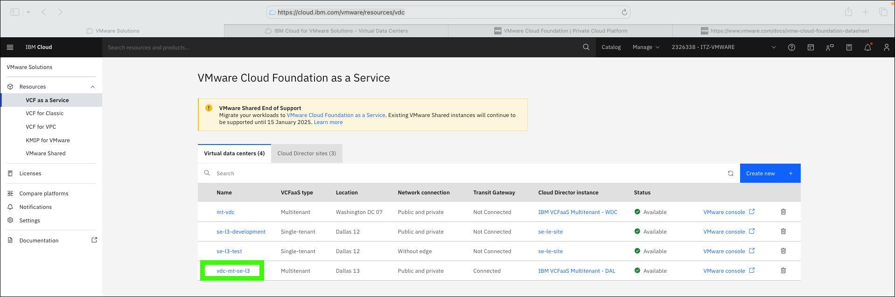

!!! Danger "Temporary workaround"

    The logical way of accessing the IBM Cloud monitoring instance is described in **step 4**. However, there seems to be an issue when accessing the monitoring instance this way. Users are receiving an **unknown error**.

    **As a work around, follow these 3 steps instead and then skip to step 5.**

    **4a-work around.** Click the **menu icon** then **Observability** and select **Instances** under the **Monitoring** section.

    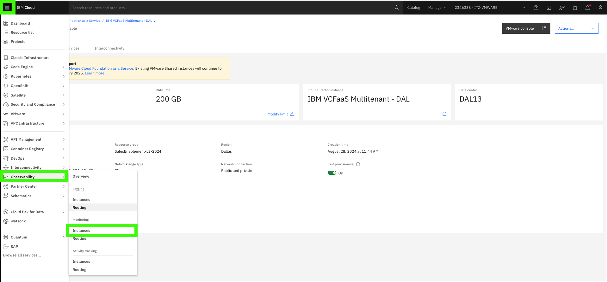

    **4b-work around.** Click **Cloud Monitoring-qp** in the monitoring instances table.

    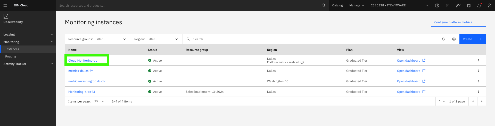

    **4c-work around.** Click **Open dashboard**.

    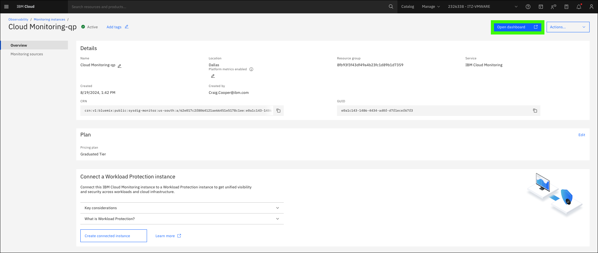

    **4d-work around.** In left menu, select **Dashboards** and then **VMware as a Service - Virtual Data Center**.

    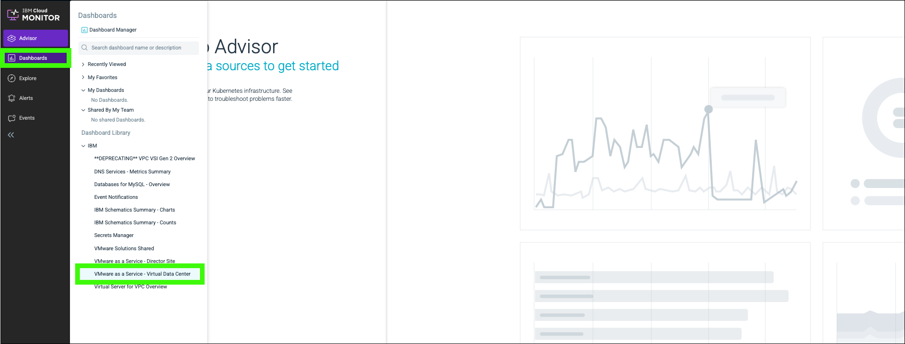

    Continue to **step 5**.

4. Click **Actions** and select **Monitoring**.

    !!! Info "You may be prompted to authenticate"

        When IBM Cloud Monitoring opens, you may be prompted to re-authenticate to IBM Cloud. Follow the instructions provided. The authentication steps are not listed here.

    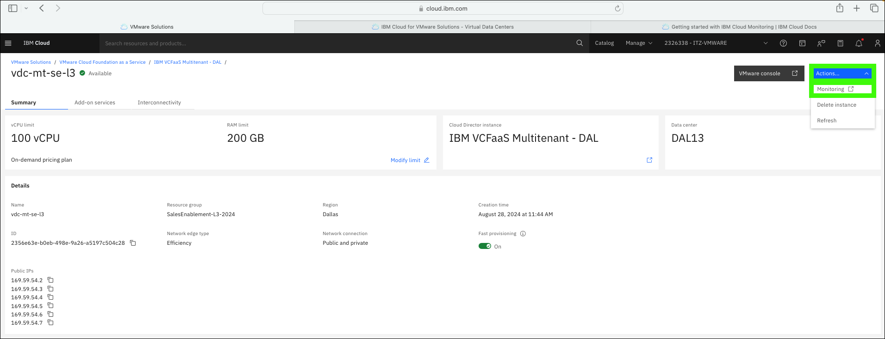

5. Adjust the **timeline** so more data is displayed.

    The data and graph presented may show little change in the environment with the default timeline view of 1 hour (1H). Adjust the timeline to show more or less data.

    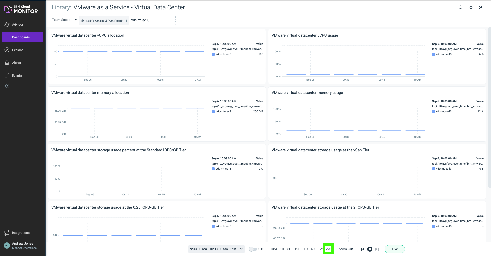

6. Review the data presented in the default dashboard: **VMware as a Service - Virtual Data Center**.

    A few items to note:

    **a.** The default dashboard is from the library and is called **VMware as a Service - Virtual Data Center**.

    **b.** The **Team Scope** is set to the **{{itz.VCFaaSmt.name}}** instance.

    **c.** The spike seen here is when the first vApp was created in the environment.

    !!! Tip "Left menu"

        The left menu of IBM Cloud Monitoring may be collapsed to only display icons. If you only see icons, expand the left menu by clicking the ">>" icon.

    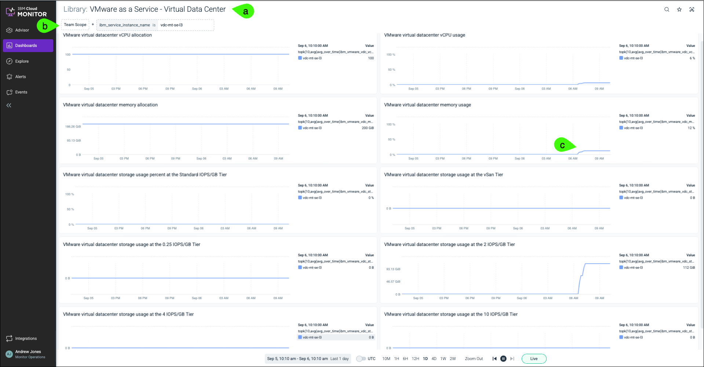

7. Click **Dashboards**, expand **IBM**, and select **VMware as a Service - Director Site**.

    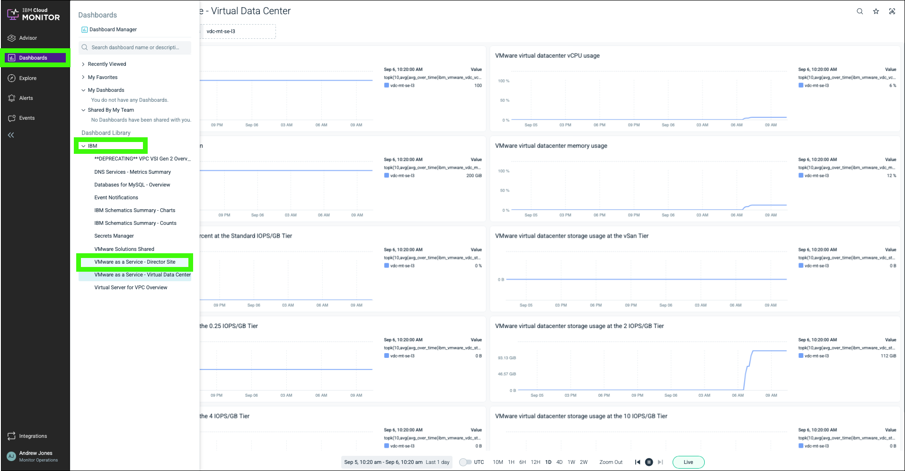

8. Review the data presented in the **VMware as a Service - Director Site** dashboard.

    Very little data was in this new environment at the time this screen was captured, but notice the data does reflect the new environment, and the first vApp that has 2 virtual machines (VMs).

    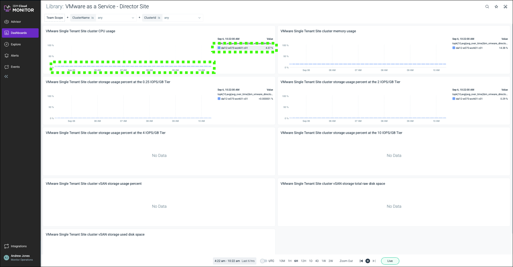

9. Explore the other options available in IBM Cloud Monitoring.

    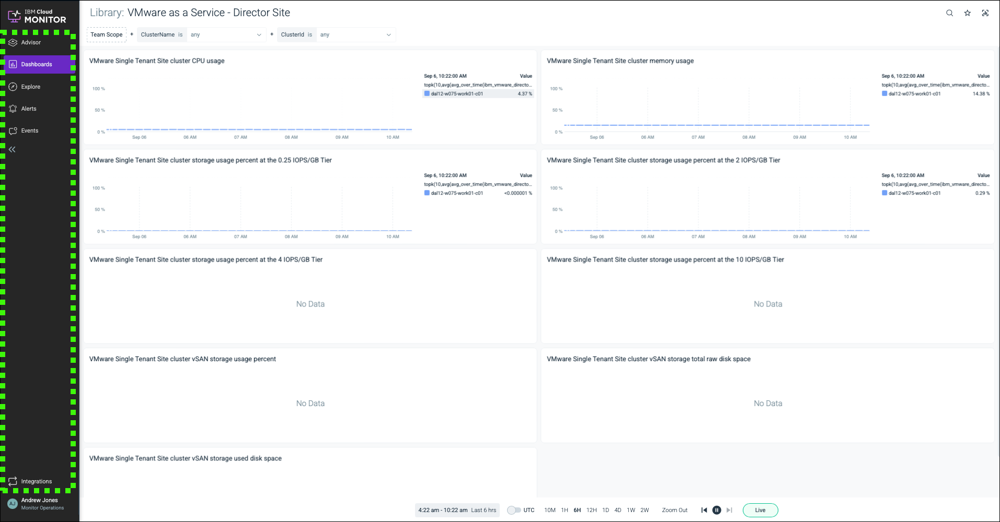

As the shared ITZ environment is utilized more, expect to see more data presented in the dashboards. 

