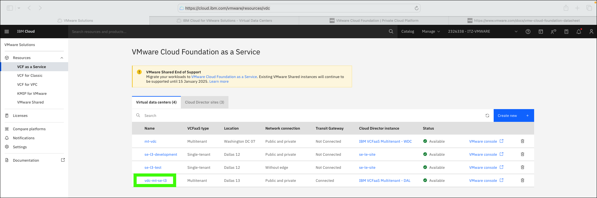

Having completed the earlier modules on provisioning a VMware Cloud Foundation (VCF) as a Service multitenant instance, it is now time to operate and use the VCF environment.

VCF provides a robust private cloud environment running on public cloud infrastructure (like IBM Cloud). VCF includes the full VMware stack of products including vSphere for compute, vSAN for storage, NSX for networking, and Aria for management. 

These VMware products are large, complex, and full of many, many features. The intent of this module is not to demonstrate all the capabilities of VCF, rather to provide basic education and demonstration capabilities that illustrate:

- how the *"on IBM Cloud"* capabilities of the **VCF as a Service multitenant** are exposed through the VMware web console (VMware vCloud Director (VCD))
  
- how to provision basic resources including data center groups, networks, and virtual machines using VCD

- illustrate how a **VCF as a Service multitenant** instance on IBM Cloud is just like VCF in a client's enterprise datacenter

!!! Important "About the IBM Technology Zone (ITZ) environment"

    The steps that follow are specific to the ITZ environment reserved as part of the {{learningplan.name}} learning plan. If you don't already have an active reservation, you can create one <a href="{{itz.environment}}" target="_blank">here</a>. Follow the directions specified in the "Reserve the environment" activity in the learning plan.

    All of the steps described in this module **CAN** be completed by every user of the shared ITZ environment using VMware vCloud Director (VCD). However, in some instances, creating new resources (like networks) will be discouraged. 

    **If you opt to create a resource, please delete the resource before your ITZ reservation expires!** Doing so will reduce on going maintenance costs of the environment and help preserve the usability of the shared environment.

1. Click the link below to open a browser to the IBM Cloud portal.

    <a href="https://cloud.ibm.com/vmware/resources/vdc" target="_blank">IBM Cloud portal</a>

2. Switch to the {{itz.account}} IBM Cloud account.

    

3. Click {{itz.VCFaaSmt.name}} in the virtual data centers (VDC) table.

    

4. Click **VMware console**.

    

5. Click **SIGN IN WITH OIDC**.

    Single sign-on has been enabled as part of the **VCF as a Service** integration with VCD. The integration is between the VMware components and IBM Cloud Identity and Access Management (IAM). OpenID Connect (OIDC) is an identity layer built on top of the OAuth 2.0 framework. It allows third-party applications to verify the identity of the end-user and to obtain basic user profile information. Learn more about OIDC <a href="https://auth0.com/docs/authenticate/protocols/openid-connect-protocol" target="_blank">here</a>. Learn more about the IBM Cloud IAM and VMware sign in capabilities <a href="https://cloud.ibm.com/docs/vmware-service?topic=vmware-service-vcd-ops-guide" target="_blank">here</a>.

    

    !!! Warning "You may be asked to reauthenticate to IBM Cloud"

        After clicking the **SIGN IN WITH OIDC** button, you may be asked to re-authenticate to IBM Cloud. IBM employees and business partners that have multi-factor authentication (MFA) enabled in their IBM Cloud account may also additional authentication steps to perform. These steps are not detailed here.

6. Explore the information displayed on the **Data Centers** summary page and then click the {{itz.VCFaaSmt.name}} tile.

    The screen capture shown below was taken before any resources were provisioned in the **VCF as a Service** instance. Notice all the 0 counts. Your view will be different and reflect any currently provisioned resources.

    

### Networking
The network for a **VCF as a Service** environment is a critical element that clients must plan carefully. Some information on network planning is provided in the IBM Cloud documentation <a href="https://cloud.ibm.com/docs/vmwaresolutions?topic=vmwaresolutions-vcd-ops-guide#vcd-ops-guide-networking" target="_blank">here</a>. VMware also has good documentation that is accessible through the vCloud Director web console or <a href="https://docs.vmware.com/en/VMware-Cloud-Director/10.4/VMware-Cloud-Director-Tenant-Portal-Guide/GUID-0544FE2A-B036-43E0-B549-40BACDF261B6.html" target="_blank">here</a>. The network implementation in this demonstration environment is minimal and should not be considered as a best of practice.

The next steps show how to create a datacenter group, expand the scope of an edge gateway, and create a network that can be used by virtual machines (VMs). Data Center Groups allow administrators to group VDCs together to share network resources. In this ITZ environment, a group of only one VDC will be created, but in most client environments, there will be multiple VDCs and connectivity will need to be established between them. To allow network connectivity to VMs a data center group and network needs to be created in the virtual data center. 

!!! Warning "In the ITZ enviroment, you can, but you don't need to"

    While you can create a new data center group and network in the instance, there is no need to as they have already been created in the ITZ environment. If you do create new ones, please delete yours, and only yours before your ITZ reservation expires.

7. Click the **Networking** tab.

    

8. Click the **Data Center Groups** tab.

    

9. Click **New**.

    

10. Select the {{itz.VCFaaSmt.name}} VDC and click **NEXT**.

    

11. Enter a **unique name** and **description** and click **NEXT**.

    

12. Click **NEXT** on the **Participating VDCs screen.

    

13. Click **CANCEL**.

    A VDC group has already been created in the shared environment, so no need to create one. However, if you really want to, you can click *Finish*, but please be sure to remove any resources you create.

    

    It takes a just few seconds for the VDC group to be created.

14. Click the **Edge Gateways** tab.

    

15. Click {{itz.VCFaaSmt.name}} in the table. Note the name in the table will have a unique ID appended to it.

    

16. Click **INCREASE SCOPE**.

    The scope needs to be increased to include the VDC group created earlier.

    

17. Click **DISCARD**.

    This action has already been performed on the existing edge gateway. If you were to create a new one, you would select the group in the table and click *OK*.

    

18. Click the **Networks** tab.

    

19. Click **NEW**.

    

20. Select **Data Center Group** and select the **vdc-group-mt-se-l3** group then click **NEXT**.

    

21. Review the **Network Type** page and then click **NEXT**.

    A Routed network is chosen to allow the virtual machines to communicate with each other within the VDCs, and potentially outside to other resources like the Internet or other IBM Cloud services.

22. Enter a **Name** and **Description** and then specify a new CIDR and click **NEXT**.

    In this demonstration environment, a network is created using the non-routable 192.168.1.1/24 private network. Later, explore how network address translation (NAT) can be configured to allow Internet access that uses the public IP addresses associated with the VDC.

    The *Dual-Stack Mode* enables support for both IPv4 and IPv6 addressing. The *Distributed Routing* option provides fast and efficient East-West routing. This can be disable to connect to the service router and force all VM traffic through the service router.

    

23. Review the **Static IP Pools** page and then click **NEXT**.
24. Enter **161.26.0.10** and **161.26.0.11** for the **Primary DNS** and **Secondary DNS** and click **NEXT**.

    The 161.26.0.10 and 161.26.0.11 addresses are the IBM Cloud public DNS addresses.

    

25. Click **CANCEL**.

    This action has already been performed on the existing network. If you were to create a new one, you would click *FINISH*.

    

    Once the network is created and the status turns to **Normal**, the next step is to activate dynamic host configuration protocol (DHCP) so VMs are automatically assigned network addresses when they are provisioned.

26. Click **vdc-mt-se-l3-defaultNetwork** in the table.

    

27. Click **DHCP** in left menu.

    

!!! Important "Please read about the next few steps"

    The next few steps **cannot** performed with the default network already created in the ITZ environment. You can perform them if you create a new network. The steps are provided for education purposes. The next step you can actually perform is step XYZ.

28. Click **ACTIVATE**.

    Note, this option will not be available for the network already created, rather you will see *DEACTIVATE*. **DO NOT** *deactivate* DHCP for the default network!

    

29. Review the **General Settings** and click **NEXT**.

    

30. Click **ADD** and then enter a valid IP Range for the network's CIDR and then click **NEXT**.

    

31. Enter **161.26.0.10** and **161.26.0.11** for the *DNS Servers** and click **NEXT**.

    

32. Review the settings and click **FINISH**.

    

The network is now setup and ready to be used.
### Create a virtual machine

33. Click **Applications**.

    

