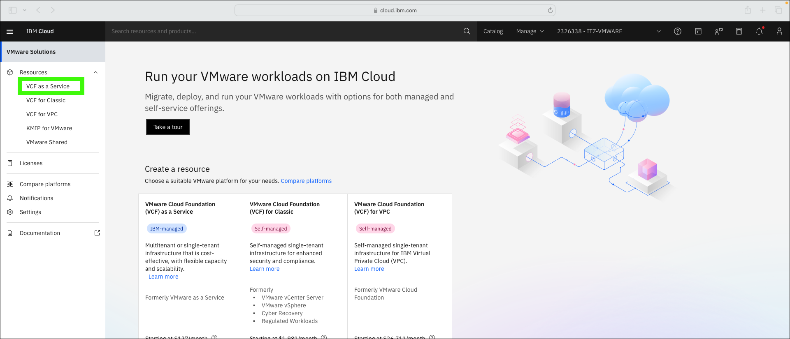
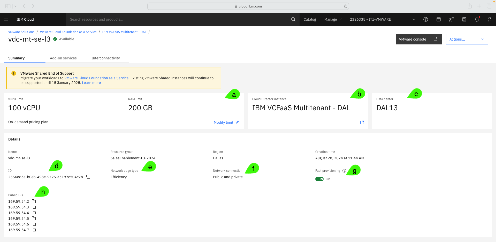
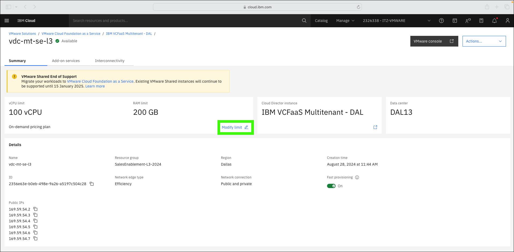
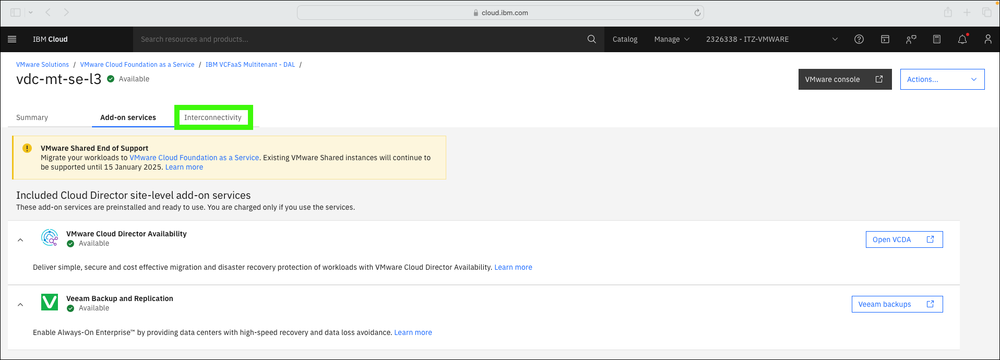
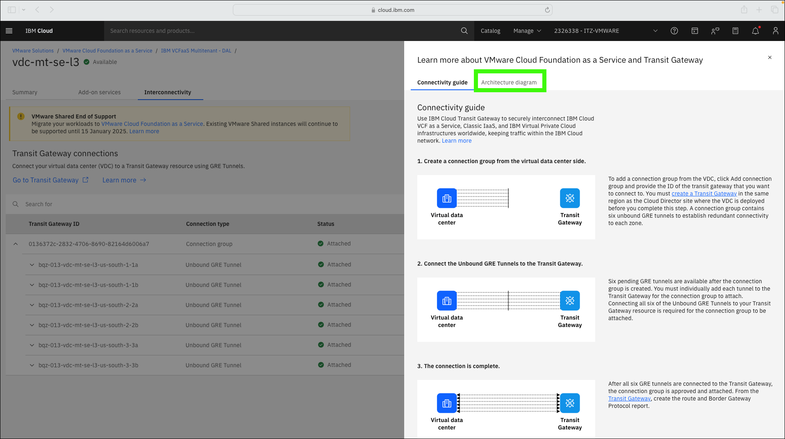
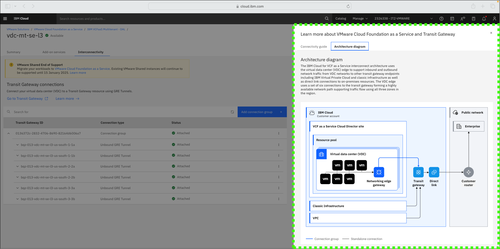
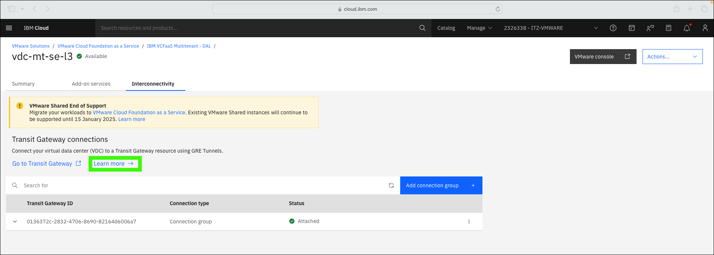

There are two aspects of managing a VMware Cloud Foundation (VCF) as a Service (VMwaaS) multitenant instances. At a high level, these are the management of the "on IBM Cloud" aspects of a VCF as a Service instance and managing the virtual data center (VDC) with VMware vCloud Director (vCloud Director).

This chapter focuses on using the IBM Cloud portal to manage aspects of the Virtual Data Center (VDC) like:

- adding and deleting instances
- modifying the vCPU and RAM limits of the instance
- accessing the VMware vCloud Director web console
- accessing add-on services
- managing interconnectivity
- adding and accessing IBM Cloud Monitoring

!!! Important "About the IBM Technology Zone (ITZ) environment"

    The steps that follow are specific to the ITZ environment reserved as part of the {{learningplan.name}} learning plan. If you don't already have an active reservation, you can create one <a href="{{itz.environment}}" target='_blank">here</a>. Follow the directions specified in the "Reserve the environment" activity in the learning plan.

    Remember, in the ITZ environment you will **NOT** have permission to create, delete, or modify resources. You will be utilizing pre-provisioned and pre-configured resources that are shared by all users of the learning plan.

    The steps outlined go up to the point of creating, deleting, or modifying a resource and then instruct you to cancel the pending action. This approach is common for client demonstrations as some events take longer than you would want to wait during a live demonstration. Explain to the client what would occur if the action had been completed (for example, "the resource would then be deleted.").

    If an attempt is made to complete the action in the ITZ environment an error message would be shown like:

    

1. Click the link below to open a browser to the IBM Cloud portal.

    <a href="cloud.ibm.com" target="_blank">IBM Cloud portal</a>

2. Switch to the {{itz.account}} IBM Cloud account.

    

3. Click the VMware () icon.   

    

4. Click **VCF as a Service** in left menu.

    

    Notice the 2 tabs: **Virtual data centers** and **Cloud Director sites**. For this demonstration, use only the **{{itz.VCFaaSmt.name}}** virtual data center (VDC)! As you are accessing the live IBM Cloud portal, the number of data centers you see may vary. The **{{itz.VCFaaSmt.name}}** VCD is part of the **IBM VCFaaS Multitenant - DAL** VMware Cloud Director (VDC) site. This site is managed by IBM and other tenants that selected the Dallas location. This chapter will only focus on the VDC and not the site.

5. Click **{{itz.VCFaaSmt.name}}**.

    

### VDC instance summary 
6. Examine the information shown on the VDC instance summary page.

    a. The vCPU and RAM limit shows the consumptions limits that were specified when the instance was provisioned.
    b. The pricing plan selected for the instance.
    c. The VDC site where the VCD is located.
    d. The location of the VCD.
    e. The VCD instance ID. This is required when accessing the instance through the IBM Cloud application programming interfaces (APIs) and command line interfaces (CLIs).
    f. The network edge type.
    g. The connections supported.
    h. The fast provisioning setting.
    i. The public IPs assigned to the VCD instance.

    

7. Click **Modify limit**.

    

8. Examine the **consumption limit** options.

    Recall that the vCPU and RAM charges for on-demand virtual data centers are based on the amount that is used for running workloads. To control cost, clients can use limits to restrict the maximum amount of vCPU and RAM usage in the virtual data center. Consumption limits can also be turned off.

    a. Toggle to enable or disable consumption limits.
    b. Increase or decrease the maximum number of vCPUs between 1 and 2000.
    c. Increase or decrease teh maximum amount of memory (RAM) between 1 gigabyte (GB) and 40,960 GB.

    

9. Click **Cancel**.

### VDC Add-on services
10. Click the **Add-on services** tab.

    

11. Examine the included **Add-on services** for the VDC instance.

    !!! Warning "Access to the **Add-on services** not provided in the ITZ environment"

        At this time, administrative access to the **Add-on services** for this instance is not provided. The IBM Cloud Identity Access Management (IAM) controls do not provide enough isolation control for these services in a shared environment like the one used for this learning plan.

        Several videos of how to use VMware Cloud Director Availability (VCDA) are included in the product documentation, including this one that illustrates <a href="https://cloud.ibm.com/docs/vmware-service?topic=vmware-service-vcda-migrating-cloudtocloud-vmaas" target="_blank">migration from the VCF as a Service multitenant instance to a VCF as a Service single-tenant instance</a>

    There are 2 **Add-on services** included in this VDC instance: 
    
    - **VMware Cloud Director Availability**

        VMware Cloud Director Availability (VCDA) delivers simple, secure, and cost effective migration and disaster recovery protection of workloads. The VCDA service is included by default in all multitenant VDCs and optionally included in single-tenant VCF as a Service Cloud Director sites at no charge. Learn more about VCDA <a href="https://cloud.ibm.com/docs/vmware-service?topic=vmware-service-tenant-vcda" target="_blank">here</a>.

    - **Veeam Backup and Replication**

        **Veeam Backup and Replication Always-On Enterprise** provides data centers with high-speed recovery and data loss avoidance. This service seamlessly integrates as a managed solution to help enterprises achieve high availability and provides recovery points for applications and data. By using this service, enterprises control the backup of all virtual machines (VMs) for their infrastructure directly from the Veeam console. For multitenant instances, Veeam is installed the VDC is provisioned. Learn more about Veeam and the simple install process <a href="https://cloud.ibm.com/docs/vmware-service?topic=vmware-service-tenant-veeam" target="_blank">here</a>.

    

### Interconnectivity
12. Click the **Interconnectivity** tab.

    

13. Click **Learn more**.

    

14. Examine the **Learn more about VMware Cloud Foundation as a Service and Transit Gateway** guide.

    IBM Cloud Transit Gateway can be used to securely interconnect IBM Cloud VCF as a Service, Classic IaaS, and IBM Virtual Private Cloud infrastructures worldwide, keeping traffic within the IBM Cloud network. Learn more about using Transit Gateway to interconnect VCF as a Service with IBM Cloud services <a href="https://cloud.ibm.com/docs/vmware-service?topic=vmware-service-tgw-adding-connections" target="_blank">here</a>.

    As illustrated, creating and configuring a Transit Gateway connection is a 3 step process. Read the high-level descriptions of the steps on the dialog.

    !!! Warning "The Transit Gateway connection in the ITZ environment"

        A Transit Gateway connection has already been created in the ITZ environment for this learning plan. Users of the shared environment do not have permission to modify or add new connections.

    

    Watch this video to see how this Transit Gateway connection was created. Note, there is no audio for this video and during longer running provisioning and configuration steps, the elapsed time has been shortened.

    
    

15. Click the **Architecture diagram** tab in the **Learn more about VMware Cloud Foundation as a Service and Transit Gateway** dialog.

    

16. Examine the **Architecture diagram**.

    The IBM Cloud for VCF as a Service interconnect architecture uses the VDC edge to support inbound and outbound network traffic from VDC networks to other transit gateway endpoints including IBM Virtual Private Cloud and classic infrastructure as well as direct link connections to on-premises resources. The VDC edge uses a set of six connections to the transit gateway forming a highly available network path supporting traffic flow using all three zones in the region.

    

17. Expand the provisioned transit gateway {{itz.tgID}}.

    

Next user VMware vCloud Director's web console to create and manage resources in the VDC.
