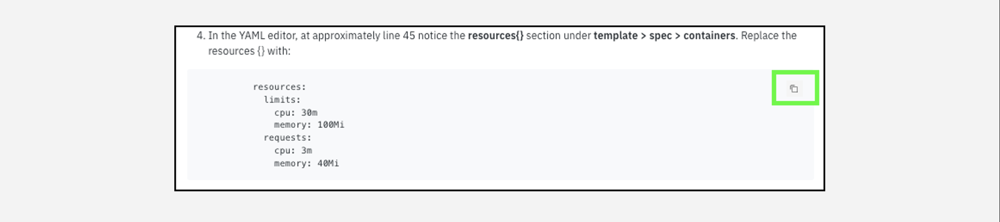

<!-- !!! Warning "Maintenance outage on Thursday, January 11 starting at 1p.m. EST"

    On Thursday, January 11, 2024 beginning at 1p.m. EST, one of the VMware as a Service (VMwaaS) instances (**se-le-site**) wil undergo maintenance. During this maintenance, the underlying VMware NSX-T deployment will be upgraded. This event is expected to last approximately 4 hours. The site and the 2 associated virtual data centers (se-l3-development and se-l3-test) will be unavailable during this period. This outage only affects your ability to complete the **Using VMware Cloud Director** section of this demonstration.

    Once the maintenance is complete, this warning message will be removed.  

    Thanks, and we appreciate your patience. -->


!!! Note Update

    This Level 3 was originally written in late 2022. Since, the IBM Cloud for VMware Solutions portfolio has added several new offerings including:

    - **VMware as a Service (VMwaaS) - Single-tenant**
    
    - **VMware as a Service (VMwaaS) - Multitenant**
   
    - **Cyber Recovery**
    
    - **VMware Cloud Foundation (VCF)**
  
    The plan is to phase out the **VMware Shared** offering in 2024/2025. Given that direction, this Level 3 has been updated to include  **VMwaaS** and **VCF** modules. The **VMware Shared** module is now optional. Not all of the videos have been updated and some will reference **VMware Shared** and **VMware Dedicated**. The Stand and Deliver requirements for IBM employees and the business partner quiz have been updated to reflect these changes. 
    
    Note, images and videos in this demonstration guide may not reflect the latest changes in the IBM Cloud portal.


Welcome to the **IBM Cloud for VMware Solutions - Level 3** course and demonstration guide! The goal is to provide IBMers and Business Partner sellers the knowledge and tools to demonstrate the **IBM Cloud for VMware Solutions** offerings.

 This course is not intended to serve as an in-depth study of VMware-specific topics; rather the focus is on the *IBM Cloud* aspects of the offerings. Numerous links and pointers to more content around VMware-specific features are included in each of the modules of this course.

Most modules include recordings and narrated instructions. Be sure to watch these videos for a visual demonstration of how to use the hands-on lab components. The videos are useful in creating and recording your Stand & Deliver presentations for Level 3 accreditation.

!!! tip "ACCREDITATION"
    To receive Level 3 accreditation, IBMers and Business Partners must demonstrate mastery of the skills that are learned throughout the various modules. Level 3 accreditation requirements and the way participants are evaluated differ depending on job role.

**Business Partners** must pass an accreditation quiz upon completing the course. The quiz consists of multiple choice questions, with four possible responses (and only one correct answer) for each question. **Hint: keep the demonstration guide and the associated IBM Technology Zone (TechZone) environment active during the quiz. Watch for the "BP quiz question"  icon in the demonstration guide.**

**IBM Sales and Tech Sales** must develop and record a Stand & Deliver presentation. This video is intended to simulate your delivery of a “live” demo in front of a client. IBMers have the flexibility to define a hypothetical client, the pain points that customer has, and the goals they aspire to achieve. The recording must be a demonstration and pitch the value of the IBM solution by using the environments and techniques of this lab.

Specific criteria that must be demonstrated as part of the Stand & Deliver recordings are provided within the documentation that accompanies the Level 3 course in Your Learning. Before continuing to the next module, read the guidance that follows. Your comprehension of the information outlined will save you time while completing the lab work.

!!! tip "FIND HELP"
    If at any point during the hands-on material you need help from the team of authors and other IBM experts, connect with the team in the <a href="https://ibm.enterprise.slack.com/archives/C03PQ47KRQE" target="_blank">#cloud-platform-demo-feedback</a> Slack channel. Any comments or suggestions are also welcome in this channel.

## Support

Think something is down? Check the applicable status pages for current updates:

-  <a href="https://techzone.status.io/" target="_blank">IBM Technology Zone</a>
-  <a href="https://cloud.ibm.com/status" target="_blank">IBM Cloud</a>

For issues with provisioning or accessing an environment in IBM Technology Zone (ITZ) open a ticket with ITZ support:
- Web:  <a href="https://ibmsf.force.com/ibminternalproducts/s/createrecord/NewCase?language=en_US" target="_blank">IBM Technology Zone</a>
- E-mail: <a href="mailto:techzone.help@ibm.com" target="_blank">techzone.help.ibm.com</a>

For issues related to specific steps found in the demonstration guide after the ITZ environment is provisioned, contact the authors:

- Slack: <a href="{{supportSlack.url}}" target="_blank">{{supportSlack.name}}</a> - IBM only
- E-mail: <a href="{{supportEmail}}" target="_blank">{{supportEmail}}</a>

Business Partners can also utilize the IBM Training live Chat Support service or other support methods found on the IBM Training portal <a href="https://ibmcpsprod.service-now.com/its?id=sc_category&sys_id=6568bfafdb2f13008ea7d6fa4b961990" target="_blank">here</a>.

## Using the demonstration guide

The Level 3 demonstration guide is organized into four chapters, covering the ```VMware as a Service```, ```VMware vCenter Server```, ```VMware Cloud Foundation```, and ```VMware Shared``` offerings of the **IBM Cloud for VMware Solutions** portfolio. These chapters contain modules that provide an *Introduction* to the offering, steps to *Provision* a deployment, and explore how clients *Manage* their instances through the IBM Cloud portal and the respective VMware tools.

!!! warning "WARNING"
    The agile nature of cloud means that the interface and layout of the IBM Cloud Portal and the IBM Cloud for VMware Solutions offerings change regularly. Screenshots and videos that are captured within this documentation might not always reflect the current versions available from IBM Cloud.

In some images, the following styles of highlighting are used:

- **Solid highlight box**: This style of box highlights where to click, enter, or select an item.


- **Dash highlight box**: This style of box highlights one of two things: the path to follow to get to a specific location in the user interface, or areas to explore on your own.


- **Copy to the clipboard**: The text is copied to the clipboard. Click the copy icon (highlighted below) and then use the operating system paste function. For example, entering ```Ctrl+v```, ```Cmd+v```, or right-click and select ```Paste```.


- **Click-thru interactive demonstrations**: Links to click-thru demonstrations open in a new browser window or tab. Click the **play** icon to get started and follow the steps that are outlined. If unsure of how to proceed, click anywhere on the screen and a highlight box indicates where to click next.


## Acronyms

The following acronyms and short-form terminology are used throughout the guide:
```
Application programming interfaces (APIs)
Classless inter-domain routing (CIDR)
Control (ctrl) - The control key on keyboard
Command (cmd) - The command key on keyboard
Disaster Recovery (DR)
Domain Name Service (DNS)
Dynamic Host Configuration Protocol (DHCP)
Gigabyte (GB)
Health Insurance Portability and Accountability Act (HIPAA)
High Availability (HA)
IBM Technology Zone (TechZone)
Identification (ID)
Identity Access Management (IAM)
Infrastructure as a Service (IaaS)
Input/output operations per second (IOPs)
Internet Protocol (IP)
Operating System (OS)
Random access memory (RAM)
Recovery Point Objective (RPO)
Reliability, Availability, and Serviceability (RAS)
Software Defined Data Center (SDDC)
Secure Shell (SSH)
User identification (ID)
Virtual Application (vApp)
Virtual Central Processor Unit (vCPU)
VMware as a Service (VMwaaS)
VMware Cloud Director (VCD)
VMware Cloud Foundation (VCF)
VMware vCenter Server (VCS)
VMware vRealize Log Insight (vRLI)
VMware vRealize Operations (vROps)
Virtual Data Center (VDC)
Virtual Machine (VM)
```
