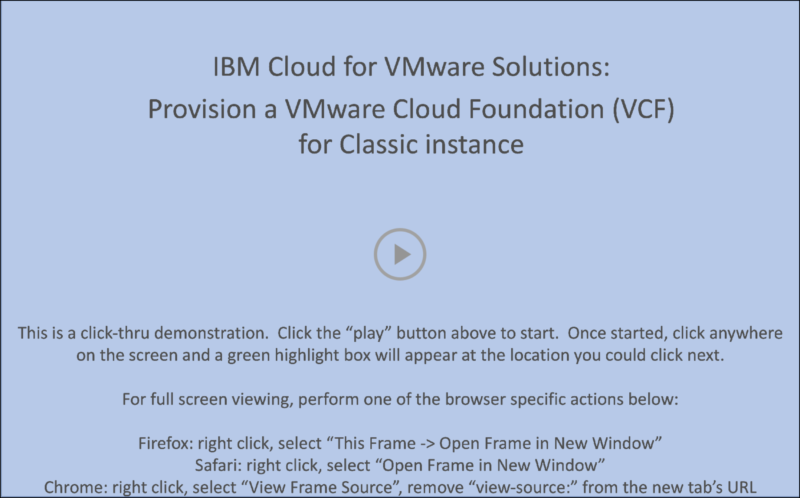

Welcome to the **{{learningplan.name}}** course and demonstration guide! The goal is to provide IBM and Business Partner technical sellers the knowledge and tools to demonstrate the **{{offering.name}}}}** offerings.

This course is not intended to serve as an in-depth study of VMware-specific topics; rather the focus is on the *IBM Cloud* aspects of the offerings. Numerous links and pointers to more content around VMware-specific features are included in each of the modules of this course.

## Obtaining the {{badge.name}} badge
**Business Partner technical sellers** must pass a short quiz upon completing the course. The quiz consists of multiple choice questions, with four possible responses (and only one correct answer) for each question. **Hint: keep the demonstration guide open and the associated IBM Technology Zone (TechZone) environment active while taking the quiz.**

**IBM technical sellers** must develop and record a Stand and Deliver presentation. This video is intended to simulate your delivery of a “live” demo in front of a client. IBMers have the flexibility to define a hypothetical client, the pain points the client has, and the goals they aspire to achieve. The recording must be a demonstration that pitches the value of the IBM solution by using the environments and techniques described in this lab.

Specific criteria that must be demonstrated as part of the Stand and Deliver recordings are provided within the documentation that accompanies the Level 3 course in Your Learning. Before continuing to the next module, read the guidance that follows. Your comprehension of the information outlined will save you time while completing the lab work. **Hint: keep the demonstration guide and the associated IBM Technology Zone (TechZone) environment active when creating the Stand and Deliver.**

## Support
Think something is down? Check the applicable status pages for any known issues like a site or service being down:

-  <a href="https://techzone.status.io/" target="_blank">IBM Technology Zone</a>

-  <a href="https://cloud.ibm.com/status" target="_blank">IBM Cloud</a>

For issues with provisioning an environment in IBM Technology Zone (ITZ) (for example, a failed reservation request due to insufficient quota capacity) open a ticket with ITZ support:

- Web:  <a href="https://ibmsf.force.com/ibminternalproducts/s/createrecord/NewCase?language=en_US" target="_blank">IBM Technology Zone</a>

- E-mail: <a href="mailto:techzone.help@ibm.com" target="_blank">techzone.help.ibm.com</a>

For issues related to specific steps found in the demonstration guide after the ITZ environment is provisioned, contact the authors:

- Slack: <a href="mailto:{{supportSlack.url}}" target="_blank">{{supportSlack.name}}</a> - IBM only
- E-mail: <a href="mailto:{{supportEmail}}" target="_blank">{{supportEmail}}</a>

Business Partners can also utilize the IBM Training live Chat Support service or other support methods found on the IBM Training portal <a href="https://ibmcpsprod.service-now.com/its?id=sc_category&sys_id=6568bfafdb2f13008ea7d6fa4b961990" target="_blank">here</a>.

## Using the demonstration guide

The Level 3 demonstration guide is organized into two chapters; covering the **VMware Cloud Foundation (VCF) as a Service** and **VCF for Classic** offerings of the **IBM Cloud for VMware Solutions** portfolio. These chapters contain modules that provide an *Introduction* to the offering, steps to *Provision* an instance, and explore how clients *Manage* their instances through the IBM Cloud portal and the respective VMware tools. The **VCF as a Service** module focuses on the **multitenant** offering and includes modules on operating an instance using VMware vCloud Director (VCD) and monitoring an instance with IBM Cloud Monitoring.

This **Demonstration Guide** uses a reactive browser-based interface. The Demonstration Guide table of contents may be displayed as highlighted in the green dashed box in this image:


However, if the browser window is sized smaller, the table of contents will only be accessible by clicking the main menu icon () (highlighted by solid green box):


Click the main menu icon () to expand the table of contents.


!!! warning "WARNING"
    The agile nature of cloud means that the interface and layout of the IBM Cloud Portal and the IBM Cloud for VMware Solutions offerings can change regularly. Screenshots and videos that are captured within this documentation might not reflect the current versions available from IBM Cloud.

In some images, the following styles of highlighting are used:

- **Solid highlight box**: This style of box highlights where to click, enter, or select an item.


- **Dash highlight box**: This style of box highlights one of two things: the path to follow to get to a specific location in the user interface, or areas to explore on your own.


- **Copy to the clipboard**: The text is copied to the clipboard. Click the copy icon (highlighted below) and then use the operating system paste function. For example, entering ```Ctrl+v```, ```Cmd+v```, or right-click and select ```Paste```.


- **Click-thru interactive demonstrations**: Links to click-thru demonstrations open in a new browser window or tab. Click the **play** icon to get started and follow the steps that are outlined. If unsure of how to proceed, click anywhere on the screen and a highlight box indicates where to click next.


## Terminology

The following acronyms and short-form terminology are used throughout the guide:

**APIs**: Application programming interfaces

**CIDR**: Classless inter-domain routing 

**Control (ctrl)**: The control key on keyboard

**Command (cmd)**: The command key on keyboard

**DR**: Disaster Recovery 

**DNS**: Domain Name Service 

**DHCP**: Dynamic Host Configuration Protocol 

**GB**: Gigabyte 

**Gbps**: Gigabits per second
**HIPAA*: Health Insurance Portability and Accountability Act 

**HA**: High Availability 

**ITZ**: IBM Technology Zone 

**ID**: Identification 

**IAM**: Identity Access Management 

**IaaS**: Infrastructure as a Service 

**IOPs**: Input/output operations per second 

**IP**: Internet Protocol 

**OS**: Operating System 

**RAM**: Random access memory 

**RPO**: Recovery Point Objective 

**RAS**: Reliability, Availability, and Serviceability 

**SDDC**: Software Defined Data Center 

**SSH**: Secure Shell

**TechZone**: IBM Technology Zone

**vApp**: Virtual Application 

**vCPU**: Virtual Central Processor Unit 

**VCD**: VMware Cloud Director 

**VCF**: VMware Cloud Foundation 

**VDC**: Virtual Data Center 

**VM**:L Virtual Machine 

**VCS**: VMware vCenter Server 

**vRLI**: VMware vRealize Log Insight 

**vROps**: VMware vRealize Operations 

